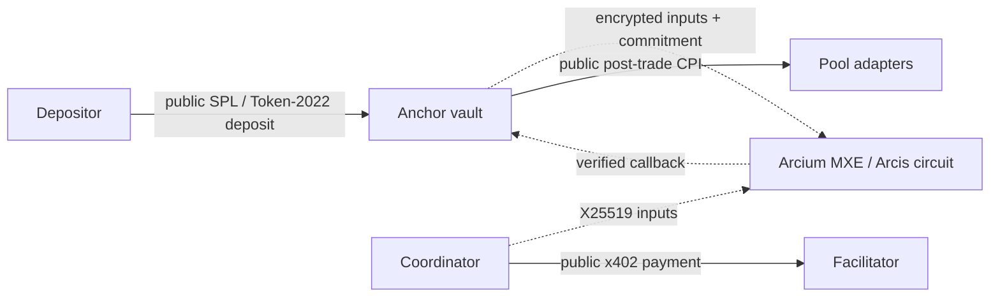

# solana-dark-vaults

Institutional allocators can use Solana's public liquidity, but a normal vault rebalance broadcasts target weights and timing before execution. ZK pools isolate liquidity, TEEs add hardware trust, and Token-2022 confidential transfers mask amounts without making allocation logic private. `solana-dark-vaults` is a reference architecture that separates encrypted strategy computation from public Solana settlement: an Anchor accounting program, a fixed-width Arcis allocation circuit, and a metered off-chain coordinator.

> [!CAUTION]
> Not audited. Not production software. Do not deploy with real capital.

<!-- Demo recording (enable only after docs/assets/demo.gif is committed):

-->



Dashed lines carry confidential inputs or outputs. Solid lines are public and observable.

## What this demonstrates / what it does not

This repository demonstrates checked share accounting, callback-authorized allocation settlement, a deterministic risk-adjusted allocator, an Arcis encrypted-instruction definition, client-side X25519 encryption, crash-safe epoch coordination, and metered x402-style payments.

It does not claim complete MEV protection. Strategy inputs and target weights can remain confidential before settlement, but deposits, withdrawals, settlement timing, CPI targets, and realized allocations are visible after execution. The pool layer is mocked. The portable demo uses local cryptography and the cleartext reference allocator; it is not an Arcium MXE execution. Token-2022 confidential custody remains feature-gated design work.

## Implementation status

| Component | Status | Evidence / boundary |
|---|---|---|
| Share math, pause, queue, callback authorization | Implemented | Rust host tests; checked integer operations |
| Fixed-three-pool reference allocator | Implemented | 24 generated fixtures plus boundary and rejection tests |
| Arcis encrypted allocation definition | Implemented, hosted Linux CI verification pending | `encrypted-ixs/src/lib.rs`; `arcium build` and `arcium test` workflow added, result pending |
| Local encrypted coordinator transport | Implemented | X25519 + AES-256-GCM; explicitly not an MXE |
| x402 payment flow | Mocked | In-process challenge, signature, retry, and cost ledger; no funds move |
| Pool settlement | Mocked | Deterministic three-position adapter; no protocol CPI |
| Token-2022 / C-SPL custody | Planned | Feature boundary documented in `docs/limitations.md` |
| Kamino / JupLend write adapters | Planned | Interface requirements documented; no mainnet writes |

## Quickstart

Clone the repository, install Rust 1.97.1 and Node.js 24 LTS, then run this block from the repository root:

```bash
npm --prefix agent-coordinator ci --no-audit --no-fund
cargo test --workspace --exclude encrypted-ixs --locked
cargo test --manifest-path arcium-circuits/Cargo.toml --locked
npm --prefix agent-coordinator run check
npm --prefix agent-coordinator test
npm --prefix agent-coordinator run demo
```

Windows users can run `powershell -File scripts/demo.ps1`; Linux and macOS users can run `./scripts/demo.sh`.

Expected demo shape:

```text
solana-dark-vaults local reference epoch
1. Mock deposit capital: 1,000,000 units
2. X25519-encrypted local submission: <computation-id>
3. Allocation output (bps): 4500 / 3500 / 2000
4. Mock settled positions: 450000 / 350000 / 200000
5. x402 mock cost ledger: 100 micro-USD
Scope: local simulator; no Solana transaction or Arcium MXE execution occurred.
```

The coordinator test suite reports **95.63% line coverage** with Node's built-in coverage runner on the initial release. The figure is reproduced by `npm --prefix agent-coordinator run coverage`; Rust coverage is not published until the local validator path is reproducible in hosted CI.

## Strategy rule

For three pools, the reference function computes `floor(yield_bps * 10_000 / risk_score)`, ranks descending, and fills each pool to its cap until exactly 10,000 bps are assigned. Ties resolve by lower pool index. Inputs with zero capital, zero risk score, an invalid cap, or aggregate caps below 10,000 bps are rejected. The rule is intentionally legible; a private deployment can replace it without changing the public settlement interface.

## Design comparison

| Approach | Confidentiality boundary | Trade-off |
|---|---|---|
| ZK shielded pool / rollup | Proves private state transitions inside a separate pool | Liquidity isolation and bridge or exit exposure |
| TEE execution | Hides logic and state inside hardware | Hardware vendor trust and side-channel risk |
| Token-2022 confidential transfer | Masks token amounts and balances | Program interactions and counterparties remain visible; allocation logic is not hidden |
| MPC over Solana | Computes over secret shares, then settles on Solana | MPC availability and cost; post-trade state and timing remain public; tooling is moving |

## Security boundary

The configured developer cluster uses two Cerberus nodes. Cerberus is a dishonest-majority protocol: confidentiality and correctness require at least one honest node, while malicious behavior can still cause an abort. A two-node local cluster is a functional test topology, not an operational decentralization claim. See the full [threat model](docs/threat-model.md), especially **What an attacker still learns**.

## Repository map

- `anchor-programs/rwa_dark_vault`: Anchor accounts, instructions, share math, and pool adapter boundary.
- `encrypted-ixs`: Arcis encrypted allocation instruction discovered by the Arcium CLI.
- `arcium-circuits`: deterministic cleartext reference implementation and fixtures.
- `agent-coordinator`: oracle boundary, local encrypted transport, crash recovery, settlement, and payment ledger.
- `docs`: account/state diagrams, assumptions, limitations, setup, and roadmap.
- `scripts`: portable demo, Arcium local-cluster gate, and executable documentation check.

## Roadmap and contributing

The release plan is in [docs/roadmap.md](docs/roadmap.md). Issues are scoped for adapter work, circuit variants, documentation, and accounting hardening. Start with [CONTRIBUTING.md](CONTRIBUTING.md), and read [SECURITY.md](SECURITY.md) before reporting a vulnerability.

## Sources

- [Birdeye, OKX, and 1inch: Solana H1 2026 report](https://birdeye.so/research/detail/solana-h1-2026-report-primed-for-the-third-leap) — market context for tokenized equities and on-chain liquidity.
- [Visa and Artemis: Agentic Payments from the Ground Up](https://www.visa.com/en-us/thought-leadership/innovation/agentic-payments-from-the-ground-up) — measured x402 activity and limits of the current market.
- [Delphi Digital: Arcium and private on-chain activity](https://members.delphidigital.io/reports/arcium-enabling-the-next-phase-of-private-on-chain-activity) — independent ecosystem analysis.
- [Arcium developer documentation](https://docs.arcium.com/developers) — installation, Arcis types, encryption, and computation lifecycle.
- [Arcium MPC protocol documentation](https://docs.arcium.com/multi-party-execution-environments-mxes/mpc-protocols) — Cerberus security assumptions.

## Author

Vishnu Govind — [GitHub](https://github.com/vishnugovind10) · [Medium](https://medium.com/@vishnugovind10) · [LinkedIn](https://www.linkedin.com/in/vishnu-govind)

Apache-2.0 licensed.
