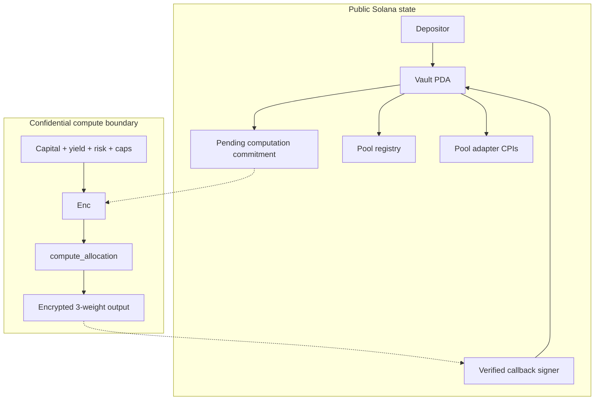
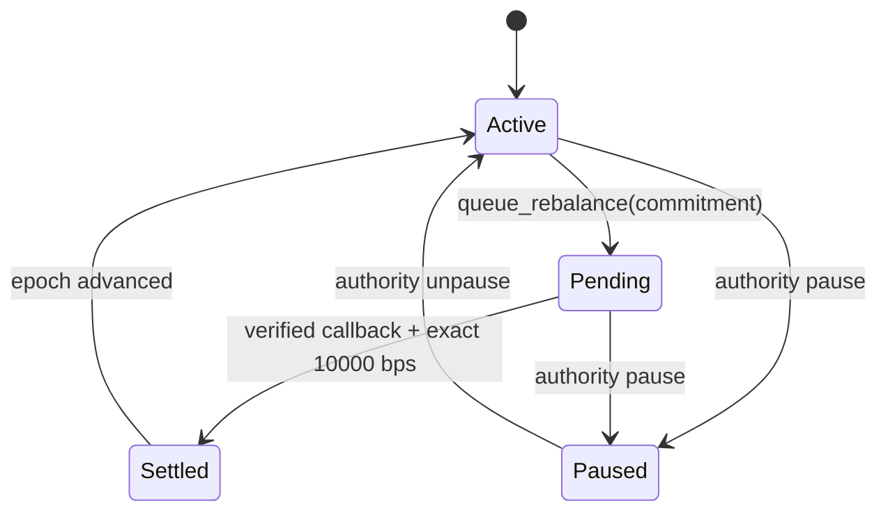

# Architecture

## System boundary

The current local coordinator exercises the same input/output contract with X25519 and AES-GCM, then calls the cleartext reference. It does not stand in for Arcium's callback proof path.

## Account model

`Vault` is derived from `['vault', asset_mint]` and stores:

| Field | Purpose |
|---|---|
| `authority` | pause and queue authority |
| `asset_mint` | canonical asset identifier |
| `callback_authority` | only signer accepted by `settle_rebalance` |
| `total_assets`, `total_shares` | integer NAV accounting |
| `epoch`, `status` | sequencing and circuit breaker |
| `pool_registry[3]` | fixed adapter targets |
| `pending_computation` | active flag, next epoch, input commitment |
| `last_weights_bps[3]` | last accepted allocation |

Deposits mint `floor(amount * total_shares / total_assets)` shares after the first 1:1 deposit. Withdrawals return `floor(shares * total_assets / total_shares)` asset units. Floor rounding prevents vault overdraft. Operations reject zero values, overflow, underflow, and sub-unit results.

## Epoch state machine

The on-chain account allows one pending computation. The coordinator writes the computation ID before settlement. A restart replays a completed epoch idempotently and refuses to overwrite a pending epoch; recovery requires checking the external computation before proceeding.

## Callback verification flow

1. The authority queues an epoch with a commitment to encrypted input bytes.
2. The client derives an X25519 shared secret with the MXE and submits `Enc<Shared, AllocationInput>`.
3. Cerberus nodes evaluate the fixed-size circuit and return encrypted weights through the Arcium callback path.
4. The Anchor handler requires the configured callback signer, the exact pending epoch, three weights at or below 10,000, and a total of exactly 10,000 bps.
5. An adapter maps weights to protocol positions. The shipped adapter is a deterministic mock and performs no CPI.

The release implements steps 1 and 4 in Anchor source and the encrypted instruction in Arcis source. Hosted Linux CI verifies the configured local-cluster build and test path; end-to-end Arcium callback account wiring is not implemented and is therefore not marked complete.

## MPC configuration

`Arcium.toml` selects two local nodes and the Cerberus backend. Arcium describes Cerberus as a dishonest-majority protocol: authenticated shares let honest nodes detect malicious behavior, correctness holds if at least one node is honest, and an adversary can still abort. The local node count tests wiring only. A deployment must separately assess operator independence, liveness, recovery set, and callback key custody.

Devnet offset `456` and mainnet offset `2026` are recorded from the current Arcium deployment documentation. These values are drift-prone and must be rechecked before deployment.
